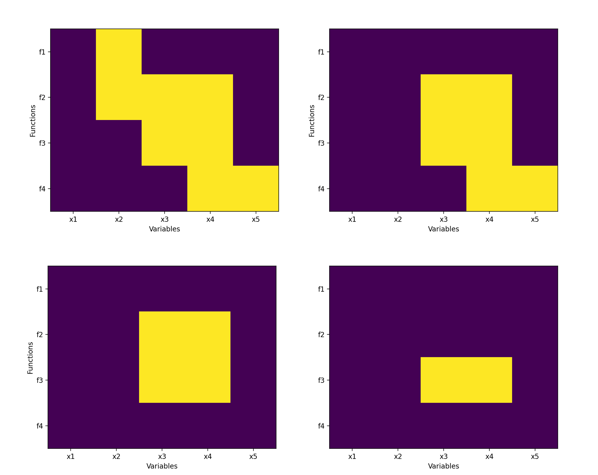
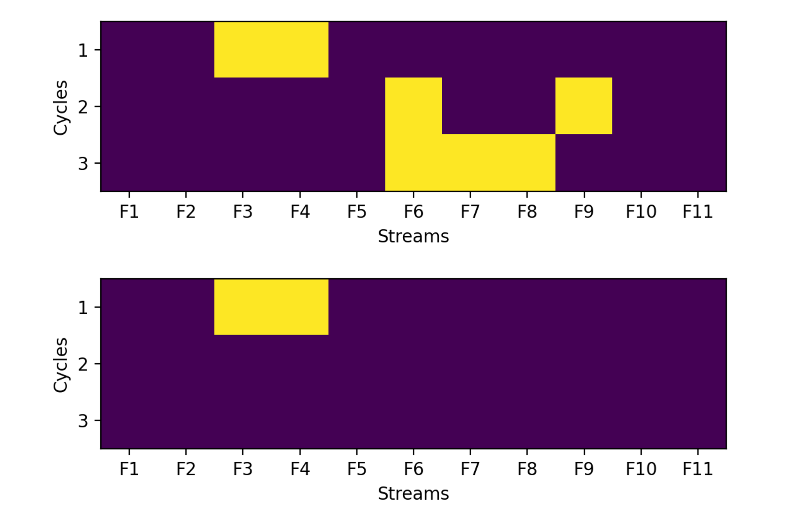

# Process Engineering Project

Project for testing the implementation of different Process Engineering concepts.

### Attention:
*I haven't yet studied the technical vocabulary in english for this subject.
It may occur that some translations are imprecise or incorrect.*

This started as a code for implementing an equation ordering algorithm (EOA).
A complex process engineering problem contains many equations that must be
solved for a complete description of the system. This modeling establishes
an algorithm for picking the order in which the equations are solved in
order to minimize the computational burden.

This inspired me to attempt to develop the algorithm in such a way that it
fetches the equations' variables automatically. Equations are defined
as functions, the values of which should equal zero. The following image
shows how a set of equations is transformed.


We can then define these functions in python and pass them to the equation
ordering algorithm (```aoe2```). Just by passing the functions, the algorithm is able to identify their
arguments. This is done with the ```inspect``` module. We can even specify the values of the known
variables (in this case, ```x1 = 1```). 

```python
# Some outputs have been hidden
from main import *
def f1(x1, x2):
    return x1 + x2

def f2(x1, x2, x3, x4):
    return x2*x1 + x3 - x4

def f3(x3, x4):
    return x3 - x4

def f4(x4, x5):
    return x4 + 5*x5

_ = aoe2(f1, f2, f3, f4, x1=1)

# Output shows:
# Equation sequence:
#  	- f1;
#  	- f3;
#  	- f2;
#  	- f4;
#  
# Variable sequence:
#  	- x2;
#  	- x3;
#  	- x4;
#  	- x5;
# 
# Opening variables:
# [comment]: variables we must give a first guess
# for solving.
#  	- x4;
# 
# Project Variables:
# [comment]: known variables.
#  	- x1;
```
In this case, we had the same amount of equations and variables (because we
specified the value of ```x1```). In cases where we have more variables than
equations, the algorithm will propose project variables that minimize the size
of iterative loops.

The following image illustrates the process of picking the order in which the
equations are to be solved. We see that ```x1``` is already dimmed since the
beginning since it's a known variable. The matrix illustrated is called the
Incidence Matrix.



Another algorithm I intend on implementing is a procedure for choosing the order
in which the system's equipments are to be simulated. Each equipment has its own
set of equations, that themselves are ordered through the EO algorithm. Since
the equipments are interconnected in a complex manner, the order in which they
are solved can also be optimized to minimize computational burden, but the
algorithm is a little different.

So far, I've finished developing an algorithm for identifying loops in
processes. For example, the following block diagram:


Can be modelled with the `Flow` and
`Equipment` classes, and integrated to a
`Process` class in the following way:

```python
# Some outputs have been hidden
from main import *
from substances import *
p = Process()
# Notice we aren't defining the stream's compositions.
F1 = Flow("F1")
F2 = Flow("F2")
F3 = Flow("F3")
F4 = Flow("F4")
F5 = Flow("F5")
F6 = Flow("F6")
F7 = Flow("F7")
F8 = Flow("F8")
F9 = Flow("F9")
F10 = Flow("F10")
F11 = Flow("F11")
A = Equipment("A")
B = Equipment("B")
C = Equipment("C")
D = Equipment("D")
E = Equipment("E")
F = Equipment("F")

# Adding the objects to the process:
p.add_objects(F1,F2,F3,F4,F5,F6,F7,F8,F9,F10,F11,D,B,C,A,E,F)
# Adding links:
p.D.add_inflows(F1,F10)
p.D.add_outflows(F2)
p.A.add_inflows(F5, F8, F9)
p.A.add_outflows(F6)
p.B.add_inflows(F6)
p.B.add_outflows(F7, F9)
p.C.add_inflows(F7)
p.C.add_outflows(F8,F10)
p.E.add_inflows(F2, F4)
p.E.add_outflows(F3)
p.F.add_inflows(F3)
p.F.add_outflows(F4, F11)
# Defining the composition of the incoming streams:
F5.add_substances(Water)
F1.add_substances(Water)
# Updating the other streams' compositions based on those:
p.update_compositions()
```

The cycles present in this block diagram can be found through the
`moa` function:

```python
from main import *
cycle_list = moa(p)
# Ignoring output for clarity
for cycle in cycle_list:
     for data in cycle:
         print(*(arg.name for arg in data))

# Output is:
# F3 F4
# E F E
# F6 F9
# A B A
# F6 F7 F8
# A B C A
```

The algorithm will also pick the streams that must give an initial guess for
in order to open the processes' cycles and solve the problem. This is done in
such a way that it minimizes the number of streams we have to estimate,
minimizing again the computational burden.

### Note:
*Implementation isn't yet finished, the algorithm isn't able to take known
stream information into account just yet.*




This is what is pushing me to develop classes for representing streams and
equipments, so that I can integrate them more easily, and in the future
integrate both approaches. A highlight is that the `Flow` class (that represents
process streams) dynamically generates its `restriction` method in a way that it
can be used by the equation ordering algorithm (given a few details) and also
represent an unique equation for only that process stream.
